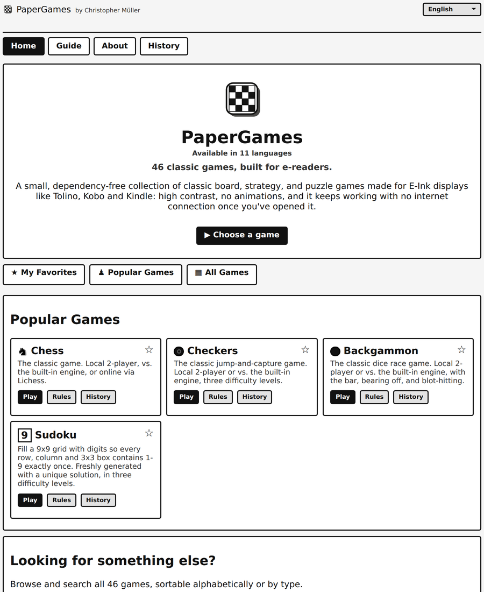

# PaperGames

A collection of 33 classic board, strategy, and puzzle games as a single
offline-capable web app, designed to be readable and usable on e-paper /
e-ink displays (high contrast, no animation-dependent UI, works without a
live network connection once loaded). Play at
[yourchaoschris.github.io/PaperGames](https://yourchaoschris.github.io/PaperGames/).

Every game is playable against a built-in AI opponent, entirely client-side.
Chess additionally supports playing real opponents online via a
[Lichess](https://lichess.org) account connection (OAuth) — PaperGames is not
affiliated with, endorsed by, or connected to Lichess in any way.

Free, no ads, no account, no tracking — everything runs and is stored
locally in your browser. Once a page has loaded once, it keeps working with
no internet connection at all.

## Games

- Chess
- Go
- Checkers
- Royal Game of Ur
- Nine Men's Morris
- Backgammon
- Xiangqi (Chinese Chess)
- Mancala
- Reversi
- Four in a Row
- Gomoku
- Senet
- Shogi (Japanese Chess)
- Sudoku
- Peg Solitaire
- Minesweeper
- Nonograms
- 2048
- Yatzy
- Lights Out
- Mahjong Solitaire
- FreeCell
- Card Tactics
- Hnefatafl
- Wall Maze
- Hex
- Halma
- Mastermind
- Dots and Boxes
- Klondike
- Amazons
- Kakuro
- Fanorona

## Languages

The interface is available in 11 languages:

- English
- German (Deutsch)
- French (Français)
- Spanish (Español)
- Italian (Italiano)
- Dutch (Nederlands)
- Polish (Polski)
- Ukrainian (Українська)
- Russian (Русский)
- Japanese (日本語)
- Chinese (中文)

## Technology

Plain HTML, CSS, and JavaScript — no build step, no framework, no backend.
Game state, settings, and stats are kept in the browser's `localStorage` /
`sessionStorage`. A service worker (`sw.js`) precaches the app shell so
already-visited games keep working offline.

## License

The PaperGames source code (HTML, CSS, and JavaScript written for this
project) is released under the [MIT License](LICENSE).

### Third-party assets

A few visual assets are third-party work, used here under their own
licenses (not the MIT grant above) — see [NOTICE](NOTICE):

- Chess piece set ("cburnett") by Colin M.L. Burnett, used under the BSD
  license (`pieces.js`).
- Xiangqi's symbol-style pieces are adapted from piece drawings originally
  by Inductiveload (Wikimedia Commons, CC BY-SA), as resplit per piece by
  Kadagaden ([github.com/Kadagaden/chess-pieces](https://github.com/Kadagaden/chess-pieces),
  "xiangqi_wikipedia_intl_modded", CC BY 4.0).
- Shogi's piece kanji are adapted from the "kanji_light" piece set by
  Kadagaden ([github.com/Kadagaden/shogi-pieces](https://github.com/Kadagaden/shogi-pieces),
  CC BY 4.0).
- The Minesweeper and FreeCell home-page icons are made by Skoll and
  Aussiesim respectively, available on [game-icons.net](https://game-icons.net)
  (CC BY 3.0).

The same notice is shown to users on the [About page](about.html).

## Legal

See [Impressum](impressum.html) (legal notice, German law) and
[Datenschutzerklärung](datenschutz.html) (privacy policy) for operator
details and data-processing information.

## GitHub topics

Suggested topics for this repository (set under Settings → General → Topics):

`eink` `ereader` `board-games` `pwa` `offline-first` `javascript`
`no-dependencies` `chess` `tolino` `kobo` `kindle`
